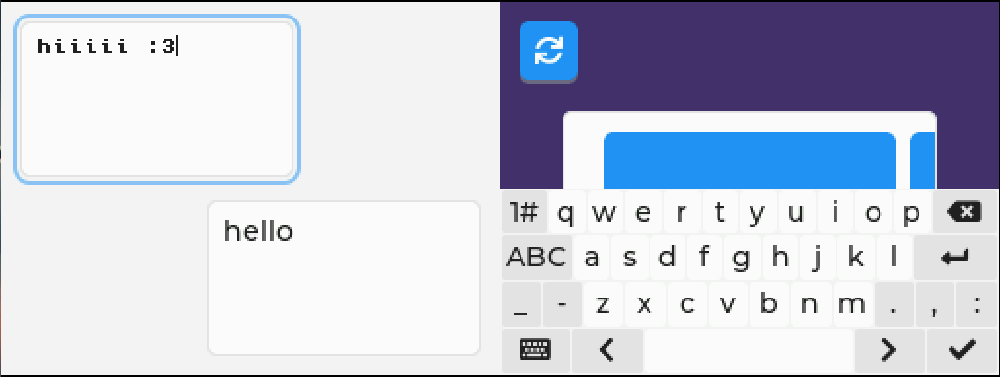

# LVGL-DS
This library provides a wrapper/driver set around LVGL which allows it to run on the DS. 
The drivers are implemented in a very straight-forward manner with little optimisation, 
but the DS is still able to drive it at 60 fps without much issue.

## Usage

1. Create a project with BlocksDS
2. In the main folder of the project, clone LVGL.
3. Create an `lv_conf.h` file in this folder (use the file `lv_conf_template.h` provided in this repo or the LVGL repo)
4. Add the following lines to your Makefile after initialising options and sources variables (see `example/Makefile`):
```make
include lvgl/lvgl.mk

SOURCES_S += $(ASRCS)
SOURCES_C += $(CSRCS)
SOURCES_CPP += $(CXXSRCS)
ASFLAGS += $(AFLAGS)
```
as well as change line 
```
$(BUILDDIR)/%.s.o : %.s
```
to
```
$(BUILDDIR)/%.s.o $(BUILDDIR)/%.S.o : %.s
```
5. Put `lvgl-ds.h` and `lvgl-ds.c` in your sources folder.
6. Include `lvgl-ds.h`. Call `lvds_init()` once and `lvds_update()` every 1/60th of a second.
7. Done! Use lvgl as normal.



## Possible improvements
- Add built-in support for using both screens as one "extended display".
- Add DS DMA support to the rendering pipeline.
- Add ARGB555 support to LVDS (speed up flushing).
- Implement full 3D engine based pipeline (significant speed up, but would only work for one screen? It doesn't seem like the tile engine features are viable)

## Notes
- Remove lvgl examples, this will speed up `make` time considerably (and `lv_conf.h` recompilations even more so).
- The filesystem component, including the file manager, work normally. Call `fatInit`(`Default`) before initialising lvgl and activate the POSIX driver in `lv_conf.h`.
- The (on-screen) keyboard component works normally.
- Due to the DS's low resolution using one of the pixel-perfect (lv_font_unscii_(8 or 16)) fonts is beneficial. These fonts do not work properly as UI for the on-screen keyboard, though.
- For logging, if one of your screens is running a console you can use `LV_LOG_PRINTF`. Otherwise, set up a no$gba style debug console with `consoleDebugInit(DebugDevice_NOCASH)` and setup a log callback which simply prints to stderr.
- The default memory usage is around 192KB (default lvgl memory limit of 64KB + 2 framebuffers), while VRAM usage is most of VRAM_B (first 98304KB, in FB0 mode) and all of VRAM_D (SUB_BG mode). As there is plenty of memory left, you may want to increase that limit.


## License
`lvgl-ds.h`, `lvgl-ds.c` and modifications to other code belong to rosa (@qdoit) and are licensed under the BSD Zero Clause License. See LICENSE

`lv_conf_template.h` and other annotated code belong to LVGL Kft and is licensed under the MIT License. See LVGL_LICENSE.txt

The utilised template belongs to the BlocksDS project and is licensed under CC-0-1.0.
